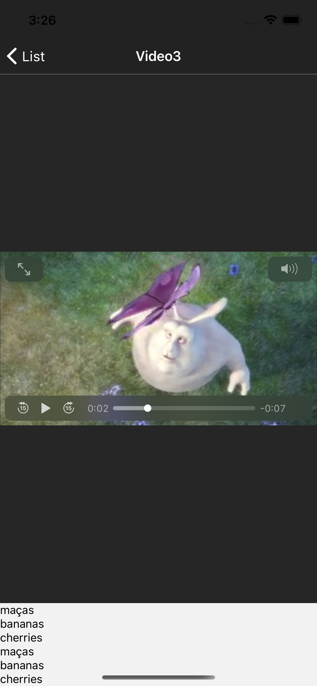

## Video Player no React Native 

- React Native Video: Muito bom, customizavel. Desvantagem: Não roda vídeo Youtube, apenas arquivos de vídeo que termine como: mp4, mov, 3gp e afins. Ele roda Vimeo, só que precisa ter a conta PRO. 
 

- React Native Youtube: Ótimo para rodar vídeos diretamente do Youtube, bem performático e também é bem customizável. Desvantagem: Só videos do Youtube.
    

 

- React Native Webview: Bem estranho rodar vídeos nele (porém funciona, sem muita opção pra customizar), com ele é possível pegar o vídeo do Youtube, do Vimeo, além de extensões de vídeo como mp4, porém:

    1. No Vimeo, a biblioteca pega a página inteira  e renderiza na tela: como no exemplo abaixo:
     

    ``A lib serve para renderizar paginas web no celular, e aparentemente foi isso que ele fez, renderizou a página do Vimeo no App`` 

    
    
     

    2. Webview rodando MP4: 
    
